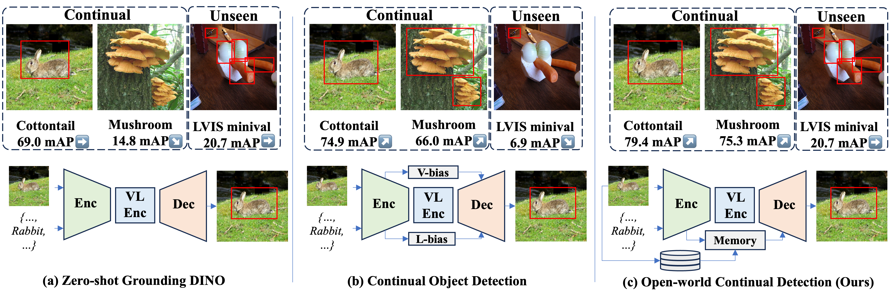

<!-- # MR-GDINO: Efficient Open-World Continual Object Detection -->

<div align="center">
  <h1>MR-GDINO: Efficient Open-World Continual Object Detection</h1>
  <br />
  <!-- <span style="color:red">📢 <strong><i>We are currently organizing the code for SALAD-Bench. If you are interested in our work, please star ⭐ our project.</i></strong></span> -->

  <h4> <a href="https://dongsky.github.io/owcod/data/preprint.pdf" target="_black">📖 Preprint</a> | <a href="" target="_black">📖 Arxiv Paper</a> |<a href="https://dongsky.github.io/owcod/" target="_blank">🚧 Project_page</a>|<a href="https://drive.google.com/drive/folders/1nwIWzqPglVpqmVa-AhJMfqnF3qTPCMQi?usp=share_link" target="_blank">📊 Checkpoints</a>|
  </h4>
</div>


## Abstract
Open-world (OW) models show strong zero- and few-shot adaptation abilities, inspiring their use as initializations in continual learning methods to improve accuracy. Despite promising results on seen classes, such abilities of open-world unseen classes are largely degenerated due to catastrophic forgetting. To formulate and tackle this challenge, we propose open-world continual object detection, requiring detectors to generalize to old, new, and unseen categories in continual learning scenarios. Based on this task, we present OW-COD, a challenging yet practical benchmark to assess detection abilities. The goal is to motivate OW detectors to simultaneously preserve learned classes, adapt to new classes, and maintain open-world capabilities under few-shot adaptations. To mitigate forgetting in unseen categories, we propose MR-GDINO, a strong, efficient and scalable baseline via memory and retrieval mechanisms within a highly scalable memory pool. Experimental results show that existing continual open-world detectors suffer from severe forgetting for both seen and unseen categories. In contrast, MR-GDINO mitigates forgetting with only 0.1\% activated extra parameters, achieving state-of-the-art performance for old, new, and unseen categories.


## Environment

We use PyTorch 2 and CUDA 12.1 to run our code on four RTX A6000 GPUs (for continual learning) and one RTX A6000 GPU (for custom data continual learning).

Our code is based on [Grounding-DINO](https://github.com/IDEA-Research/GroundingDINO) and [Open-Grounding-DINO](https://github.com/longzw1997/Open-GroundingDino). 

Sincerely thank the authors for their great work.

```bash
pip install -r requirements.txt
```

## Checkpoints

We release the 5-shot and 10-shot continual learning checkpoints. [Download here](https://drive.google.com/drive/folders/1nwIWzqPglVpqmVa-AhJMfqnF3qTPCMQi?usp=share_link)

Note that for LoRA params, for simplicity, we directly store the whole params of VL enhancer. We ensure that only LoRA params are optimized during training. 

If you find the loading issue, try the following code:
```python
a = pickle.loads(open('subtasks_lora_wo_coco_10_shot.pkl', 'rb').read(), encoding='latin1')
```
## Custom Data Training & Evaluation

The configuration of OW-COD training and evaluation data is coming soon. To ensure the deployment of MR-GDINO, we first provide the code for custom data continual learning.

Generally, the configuration of OW-COD benchmark is similar. 

### Data Preparation
1. Ensure your training/testing dataset annotations follow COCO-style format (JSON format).
2. Modify `CLASS_NUM` variable in `tools/custom2odvg.py` to match the number of new classes in your task.
3. Convert your COCO-style annotations:
```bash
python tools/custom2odvg.py --input YOUR_CUSTOM_COCO_STYLE_TRAIN_ANNO_FILE_PATH --output TRANSFERD_ANNO_FILE_NAME.json
```
4. Move the converted annotation file to the `config` folder.
5. Create `CUSTOM_label_map.json` in `config` folder with your class mapping:
```json
{
    "0": "dog",
    "1": "cat",
    "2": "bird",
    ...
}
```
6. Create `train_CUSTOM.json` in `config` folder with dataset configurations:
```json
{
    "train": [
        {
            "root": "TRAIN_IMAGES_ROOT",
            "anno": "/ABSOLUTE/PATH/OF/TRANSFERD_ANNO_FILE_NAME.json",
            "label_map": "/ABSOLUTE/PATH/OF/CUSTOM_label_map.json",
            "dataset_mode": "odvg"
        }
    ],
    "val": [
        {
            "root": "TEST_IMAGES_ROOT",
            "anno": "/ABSOLUTE/PATH/OF/YOUR_CUSTOM_COCO_STYLE_TEST_ANNO_FILE_PATH",
            "label_map": "/ABSOLUTE/PATH/OF/CUSTOM_label_map.json",
            "dataset_mode": "coco"
        }
    ]
}
```

### Training
1. Modify `start_train.sh` with your configuration file path and output directory.
2. Start training:
```bash
bash start_train.sh
```
3. For multiple tasks, maintain separate annotation files and configurations for each task, and use `start_train_more_task.sh` as reference.

### Inference
After training, the model checkpoint will be saved in the specified OUTPUT_DIR. For inference:

1. Generate task keys:
   - Extract features for each task using `extract_feat_scripts/extract_feat.sh`
   - Calculate mean features using `cal_mean_feature_per_task.py`

2. Extract PEFT modules:
   - Run `save_prompt_pth.py` to get `multi_model_prompt_params.pkl`
   - Run `save_lora_pth.py` to get `multi_model_lora_params.pkl`

3. Run inference:
   - Modify `eval_one_image.sh` with your checkpoint path, image path, and text prompt
   - Run inference:
```bash
bash eval_one_image.sh
```
   - Adjust `retrieval_tau` parameter in `tools/inference_on_a_image.py` to fine-tune results

## Citation

```
@article{owcod,
    author = {Dong, Bowen and Huang, Zitong and Yang, Guanglei and Zhang, Lei and Zuo, Wangmeng},
    title = {MR-GDINO: Efficient Open-World Continual Object Detection},
    year = {2024},
    url = {https://dongsky.github.io/owcod/data/preprint.pdf}
}
```